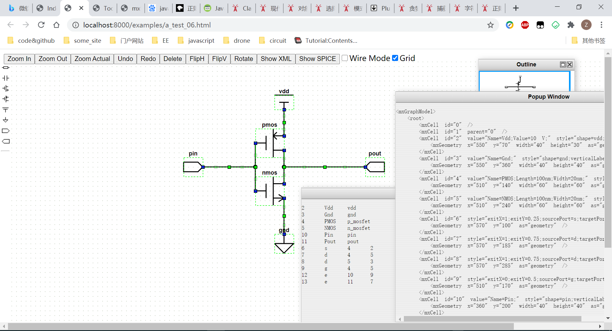
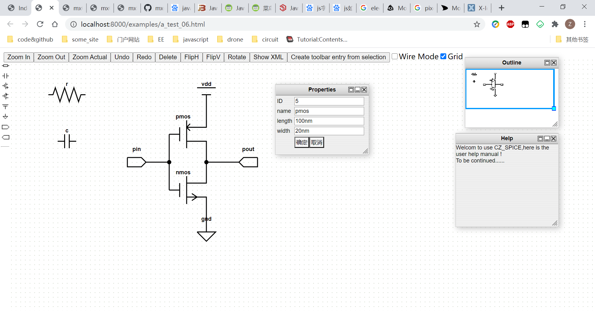

# CZ_OpenSpice

## 项目简介

本项目旨在搭建一个web版本的spice电路仿真平台。当前项目仍处于不断更新中。

本项目在gitee和github上同步更新。

* github地址为`https://github.com/ColsonZhang/CZ_OpenSpice`
* gitee地址为`https://gitee.com/colson-zhang/CZ_OpenSpice`

## 项目框架

### Schematic

能够绘制电路原理图的web前端代码，主要采用mxGraph代码构建。

#### 运行方法

进入`./Schematic`路径下

执行`python server.py`

在浏览器中打开`localhost:8000`进入文件服务器，在文件服务器中打开`./template/schematic.html`文件即可

### Server

整个项目的后端服务器代码，主要基于Tornado、Bokeh框架开发。

## 环境配置

### Python环境

需要使用`python>=3.6`，同时需要安装如下几个python包，可以通过`pip install pkg-name`的方法进行安装，例如 `pip install tornado`

* `tornado`
* `datetime`
* `pycket`
* `pymongo`
* `pymysql`

### 数据库

需要安装如下几个数据库，并进行配置，配置的信息在`./Server/handler/MongoDB.py`和

`./Server/handler/MysqlDB.py`中均有记录

* `redis`
* `mysql`
* `mongodb`

## 项目启动

进入`./Server/`路径，执行`python app.py`

## 更新日志

* 2021年2月1日，前端更新

  * 发现bug，拖拽元件时，发现连线无法跟着移动
  * 增加了对xml格式文件的电路解析info
  * 将电路具体的解析info转换为spice网表电路功能待开发
  * 
* 2021年1月31日，前端更新

  * 增加了元件属性修改功能，增加了对属性的解析
  * 更新了几个元件的icon，可以在这个网站上绘制相应的像素图表http://www.xiconeditor.com/
  * 增加了按下delete键删除元素的功能
  * 发现了一些bug，例如当进行FlipH和FlipV时端口无法跟着进行翻转
  * 当前的功能界面如下图所示
  * 
* 2021年1月28日，前端更新

  * 增加了一些功能控件，完成基本雏形
  * 将元件的属性暂时全部写在元件的value中，之后可以尝试使用userobject进行存储。
  * 增加了修改元件属性的windos窗口，但是value的parse函数仍在搭建
* 2021年1月26日，重大更新！！！增加了前端电路绘制功能demo

  * 改变技术方案，放弃采用MIT的Jade电路绘制前端，改为使用mxGraph设计电路绘制功能
  * 当前已经可以实现绘制简单的电路原理图，并将拓扑关系提取到xml格式文件中，后续可设计程序将xml转换为spice文件
  * 当前已经增加了几个简单的N_Mosfet P_Mosfet Vdd Gnd Resistor等元件的图表
  * 但是，还有很多细节需要继续填充
* 2021年1月26日，修复了一些小bug，增加了一些配置信息

  * 增加了README的内容
  * 再次测试代码，修复一些bug，例如注册时未往数据库中写入email等
  * 把部分js代码单独提取出来到一个文件夹下面
* 2021年1月22日，进一步完善服务器基本框架。

  * 基本尝试使用了BokehJS库的使用，计划用JS替代Python版本的Bokeh功能控件。
  * 尝试Plotly的使用，计划作为Bokeh的备选。
  * 尝试使用Javascript的Jquery库，利用ajax向服务器发送post请求传递信息。
  * 发现Python版本的Bokeh功能控件部署在服务器上存在的一些问题，包括后台终端无后台信息等，暂时将该功能控件禁用。
  * 新增Mongo数据库的使用，计划用来记录用户的行为数据；该数据库的部署已经完成；该数据库的python封装已完成雏形，但尚不完善，需要后续根据采集节点的设计进一步完善。
  * 后续需要在项目管理方面进行梳理，当前代码库已经存在一定的混乱。
  * 将代码库中的`font-awesome`css库从本地删去，改为线上CDN加载。
* 2021年1月20日，完成了服务器基本框架的搭建。实现的功能有：

  * 用户登录、认证、退出系统，新用户注册新账户
  * 在mysql数据库中存储、更新用户基本信息
  * 一个基本的仿真的app，功能为spice语言描述的电路传入后台，后台调用ngspice或xyce进行仿真（暂未对仿真结果进行处理，仅返回是否仿真成功）
