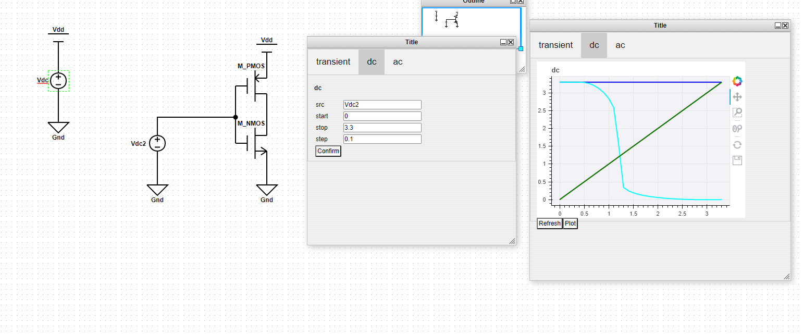
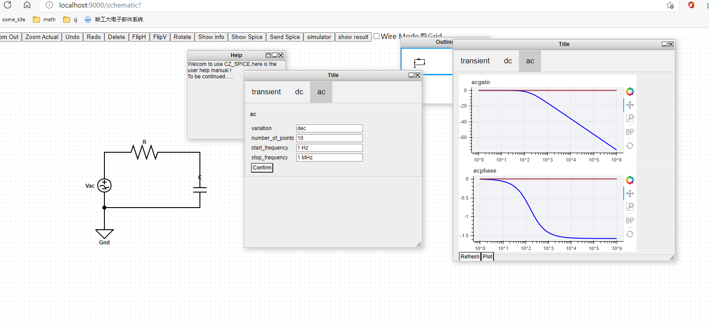
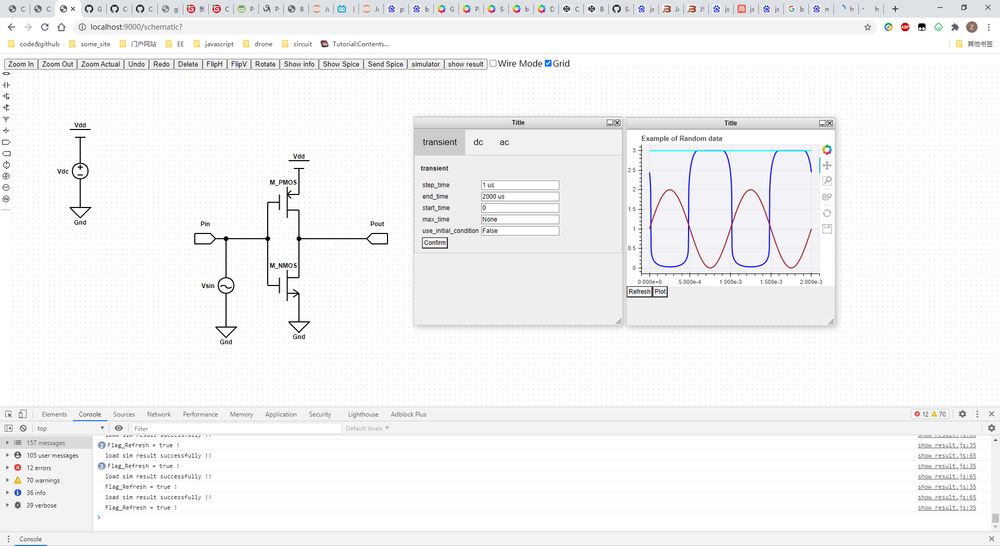
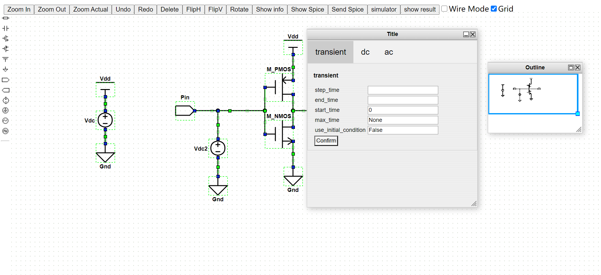
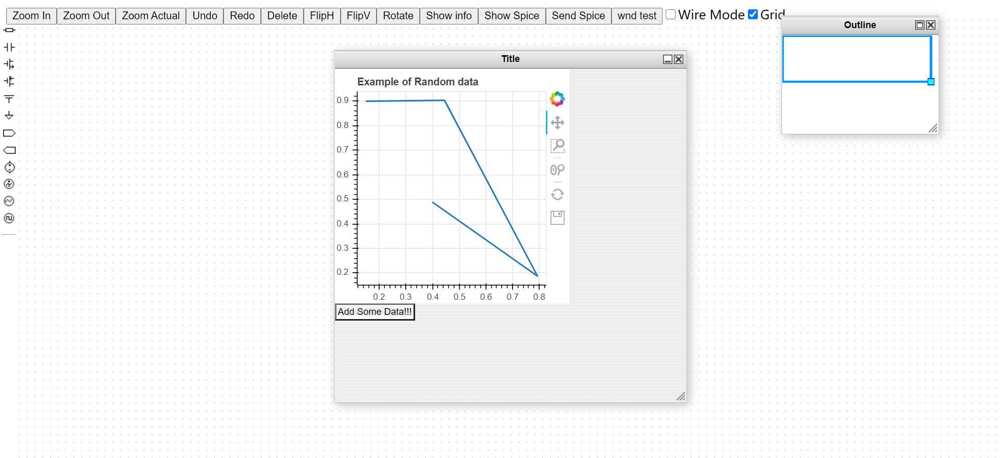
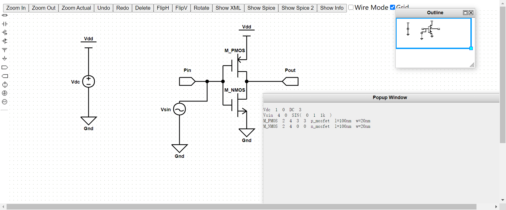
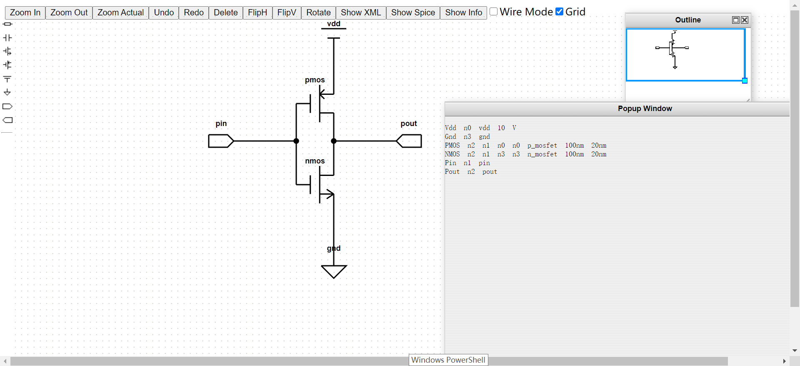

# CZ_OpenSpice

## 项目简介

本项目旨在搭建一个web版本的spice电路仿真平台。当前项目仍处于不断更新中。

本项目在gitee和github上同步更新。

* github地址为`https://github.com/ColsonZhang/CZ_OpenSpice`
* gitee地址为`https://gitee.com/colson-zhang/CZ_OpenSpice`

## 项目框架

整个项目的后端服务器代码，主要基于Tornado、Bokeh框架开发。

```
+doc           ----项目日志文件
+handler       ----项目服务器python文件
+spice         ----spice仿真测试文件
+static        ----静态文件
...+login          ----登录界面网页资源
...+register       ----注册界面网页资源
...+schematic      ----前端绘制电路图界面网页资源
+template      ----网页模板
...+auth           ----登录、注册界面网页
...+schematic      ----绘制电路图界面网页
...+spice          ----spice测试界面网页
...index.html      ----网站主页面网页
requirements   ----环境需求
README.md      ----用户须知
app.py         ----服务器的主程序
```

## 环境配置

### Python环境

需要使用`python>=3.6`，同时需要安装如下几个python包，可以通过`pip install pkg-name`的方法进行安装，例如 `pip install tornado`

* `tornado`
* `datetime`
* `pycket`
* `pymongo`
* `pymysql`

### 数据库

需要安装如下几个数据库，并进行配置，配置的信息在`./handler/MongoDB.py`和

`./handler/MysqlDB.py`中均有记录

* `redis`
* `mysql`
* `mongodb`

## 项目启动

进入项目路径，执行`python app.py`

## 更新日志

* 2021年3月24号，前端更新

  * 新增：多种仿真模式下的数据显示，主要解决了在ac仿真模式下对数轴的问题和两个绘图框的问题
  * 新增：解决了simulator窗口和show_result窗口tab功能混淆的问题
  * dc仿真展示
  * 
  * ac仿真展示
  * 
  *
* 2021年3月23号，前端更新

  * 新增：多种仿真模式下的数据显示
* 2021年3月22号，后端更新

  * bug1：当放置同一种组件时，名称存在重复；手动更改名称后，需要将组件进行移动后，名称才会修改。
  * bug2：当进行组件的复制后，将组件的部分元件进行调整，将无法提取spice。
  * bug3：Tab的作用域问题，希望Tab的openmode函数中加入作用域。
  * 新增：DC仿真处理
* 2021年3月20号，前端更新

  * 新增：仿真结果数据显示，成功将仿真得到的节点电压绘制出来。
  * todo：绘制仿真结果时增加用户配置项目，可以进行选择性绘图。
  * transient仿真结果展示
  * 
* 2021年3月18号，后端更新

  * idea & todo：仿真结果数据可视化的基本思路为：在后端的python代码中，用一个自定义类封装的simulation result data container来容纳数据，并新增一个用于处理get/post请求的处理函数，当前端需要这些相关数据时，通过ajax发送过去；同时前端使用bokehjs封装一个通用的结果显示的“示波器”，向服务器后端发送请求，接收相关数据，并展示结果。
* 2021年3月17号，后端更新

  * 新增：根据前端传入的电路数据和仿真参数，进行参数转换，调用pyspice执行电路仿真
  * 待解决：仿真结果传递回前端，进行可视化展示
* 2021年3月16号，前端+后端更新

  * 新增：成功将spice网表和simulation设置参数传入后端
  * 待解决1：前端代码冗杂，缺乏层次
  * 待解决2：需要在后端根据传入参数进行电路仿真， 并将仿真结果传递回前端
  * 待解决3：将常用的单位转换为pyspice能够识别的单位（string to specfic unit）
* 2021年2月9号，前端更新

  * 发现bug: 当schematic中没有组件时，spice的parse函数抛出错误
  * 待解决：如何将spice网表和simulation同时传入服务器
  * 新增：仿真的参数设置
  * 
* 2021年2月8号，前端更新

  * 新增在弹出窗口里嵌入bokehjs代码的功能
  * 
* 2021年2月8号，前端更新，后端更新

  * 优化了mos器件的描述方法
  * 增加了电源模型
  * 增加全局Vdd同步属性
  * 将前端schematic和后端server进行结合，成功将spice网表发送到后端服务器，并存储到数据库中
* 2021年2月8号，前端更新

  * 优化了schematic电路图提取spice网表功能
  * 新增加了多种电源器件
  * 初步实验了将提取出来的spice网表送进spice仿真器中执行仿真的结果
  * 
* 2021年2月2日，前端更新

  * 增加电路spice网表提取功能
  * 但是spice网表的具体格式仍存在一些小问题，需要与spice语法规则做进一步的校准
  * 另外，元件的名称需要增加自动调整功能，来保证所有元件名称的唯一性
  * 
* 2021年2月1日，前端更新

  * 发现bug，拖拽元件时，发现连线无法跟着移动
  * 增加了对xml格式文件的电路解析info
  * 将电路具体的解析info转换为spice网表电路功能待开发
  * 
* 2021年1月31日，前端更新

  * 增加了元件属性修改功能，增加了对属性的解析
  * 更新了几个元件的icon，可以在这个网站上绘制相应的像素图表http://www.xiconeditor.com/
  * 增加了按下delete键删除元素的功能
  * 发现了一些bug，例如当进行FlipH和FlipV时端口无法跟着进行翻转
  * 当前的功能界面如下图所示
  * 
* 2021年1月28日，前端更新

  * 增加了一些功能控件，完成基本雏形
  * 将元件的属性暂时全部写在元件的value中，之后可以尝试使用userobject进行存储。
  * 增加了修改元件属性的windos窗口，但是value的parse函数仍在搭建
* 2021年1月26日，重大更新！！！增加了前端电路绘制功能demo

  * 改变技术方案，放弃采用MIT的Jade电路绘制前端，改为使用mxGraph设计电路绘制功能
  * 当前已经可以实现绘制简单的电路原理图，并将拓扑关系提取到xml格式文件中，后续可设计程序将xml转换为spice文件
  * 当前已经增加了几个简单的N_Mosfet P_Mosfet Vdd Gnd Resistor等元件的图表
  * 但是，还有很多细节需要继续填充
* 2021年1月26日，修复了一些小bug，增加了一些配置信息

  * 增加了README的内容
  * 再次测试代码，修复一些bug，例如注册时未往数据库中写入email等
  * 把部分js代码单独提取出来到一个文件夹下面
* 2021年1月22日，进一步完善服务器基本框架。

  * 基本尝试使用了BokehJS库的使用，计划用JS替代Python版本的Bokeh功能控件。
  * 尝试Plotly的使用，计划作为Bokeh的备选。
  * 尝试使用Javascript的Jquery库，利用ajax向服务器发送post请求传递信息。
  * 发现Python版本的Bokeh功能控件部署在服务器上存在的一些问题，包括后台终端无后台信息等，暂时将该功能控件禁用。
  * 新增Mongo数据库的使用，计划用来记录用户的行为数据；该数据库的部署已经完成；该数据库的python封装已完成雏形，但尚不完善，需要后续根据采集节点的设计进一步完善。
  * 后续需要在项目管理方面进行梳理，当前代码库已经存在一定的混乱。
  * 将代码库中的`font-awesome`css库从本地删去，改为线上CDN加载。
* 2021年1月20日，完成了服务器基本框架的搭建。实现的功能有：

  * 用户登录、认证、退出系统，新用户注册新账户
  * 在mysql数据库中存储、更新用户基本信息
  * 一个基本的仿真的app，功能为spice语言描述的电路传入后台，后台调用ngspice或xyce进行仿真（暂未对仿真结果进行处理，仅返回是否仿真成功）
